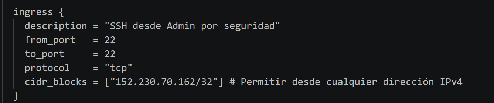
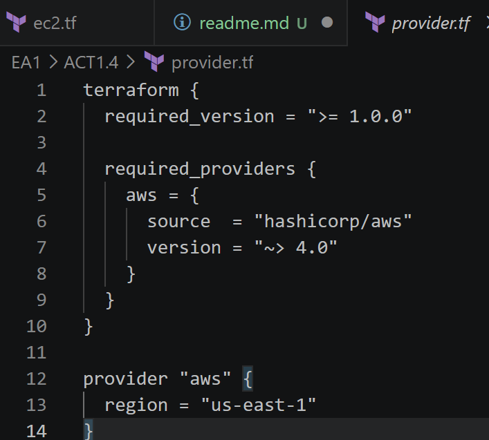
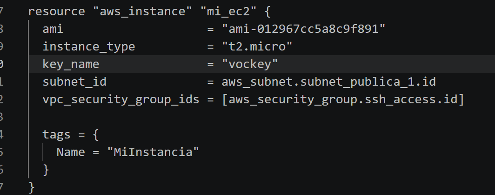
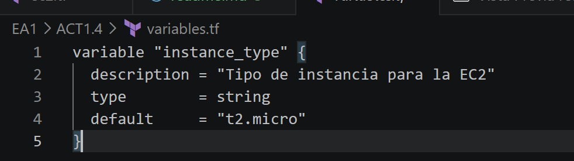
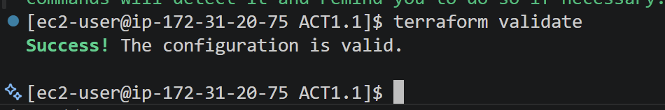
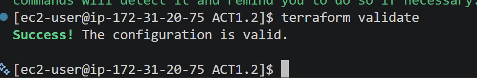
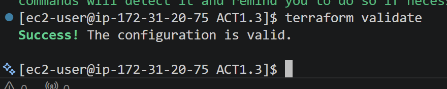

# 🚀 Proyecto de Infraestructura como Código - EA1

Este repositorio contiene la evolución de la infraestructura en AWS para la evaluación **EA1**, gestionada mediante **Terraform** y validada con flujos de **CI/CD**.

## 🛡️ Fortalecimiento de Seguridad e Infraestructura
Para cumplir con los estándares de la industria y los indicadores de logro (**IL 2.1**), se han implementado las siguientes mejoras:

* **Eliminación de Hardcoded Secrets (IL 1.2):** Se han saneado los archivos `provider.tf`, eliminando *Access Keys* y *Secret Keys* del código. La autenticación ahora se gestiona de forma segura mediante **GitHub Secrets**.
* **Acceso Restringido (Principio de Mínimo Privilegio):** Se modificaron los *Security Groups* para limitar el acceso **SSH (Puerto 22)** únicamente a la **IP del Administrador** (`/32`), eliminando la apertura global `0.0.0.0/0`.

* **Estandarización de Accesos:** Se definió de forma consistente el uso del Key-Pair `vockey` en todos los recursos EC2.

* **Modularización y Variables (IL 1.1):** Implementación de archivos `variables.tf` para la inyección dinámica de parámetros como `instance_type`, evitando la duplicidad de datos y errores de validación.

## 🛠️ Gestión de Calidad y Pipeline
* **Análisis Estático:** Integración de **Checkov** para la detección temprana de vulnerabilidades.
* **CI/CD:** Configuración de un sistema de permisos automatizado en **GitHub Actions** que valida la integridad del entorno antes de permitir cambios.

## Ejemplos del chequeo de Terraform

---